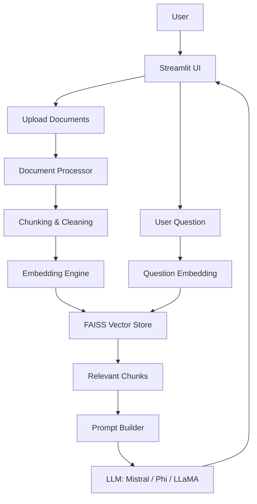
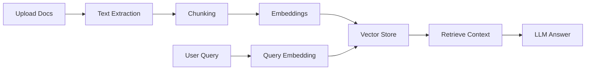

# 📄 AI Document Question Answering Chatbot (RAG)

<p align="center">
  
</p>

<p align="center">
  <b>AI-powered chatbot that answers questions directly from your documents — not from guesses.</b><br/>
  Built using Retrieval-Augmented Generation (RAG) with modern Transformer models.
</p>

<p align="center">
  <a href="https://github.com/Abhishek-09-Tomar"></a>
  <a href="https://www.linkedin.com/in/abhishek-tomar-7aa29127b"></a>
  <a href="https://leetcode.com/u/Abhishek_Tomar_99/"></a>
  <a href="https://codeforces.com/profile/Abhishek_Tomar"></a>
</p>

---

## 🚀 Project Overview

This project is a **production-style Retrieval-Augmented Generation (RAG) chatbot** that answers questions **strictly grounded in uploaded documents** such as PDFs or text files.

Instead of hallucinating, the system:

1. **Retrieves relevant information** from documents using vector search
2. **Augments the prompt** with retrieved context
3. **Generates accurate answers** using Transformer-based LLMs

It demonstrates **end-to-end system design**, clean architecture, and real-world NLP engineering.

---

## ✨ Key Features

* 📄 Upload and process PDF / text documents
* 🔍 Semantic search using vector embeddings
* 🧠 Context-aware question answering (no guessing)
* 🤖 Pluggable LLMs (Mistral / Phi / LLaMA)
* ⚡ FAISS-powered fast retrieval
* 🖥️ Interactive Streamlit web UI
* 🧱 Modular, layered architecture

---

## 🧠 Why Retrieval-Augmented Generation (RAG)?

* Prevents LLM hallucinations
* Ensures answers are document-grounded
* Scales to large document collections
* Efficient use of LLM context windows
* Industry-standard approach for enterprise AI systems

---

## 🏗️ System Architecture (High-Level)



---

## 🔄 End-to-End Workflow



---

## 🧩 Architecture (Layered Design)

### 1️⃣ Presentation Layer

* **Technology:** Streamlit
* Handles file upload, question input, and answer display

### 2️⃣ Application / Logic Layer

**Document Processor**

* PDF/text reading
* Cleaning and normalization
* Intelligent chunking

**Embedding Engine**

* Sentence-Transformers
* Dense vector representations

**Retrieval Engine**

* FAISS similarity search
* Top-k relevant chunks

**Prompt Builder**

* Combines retrieved context + user question

### 3️⃣ Model Layer

* Transformer-based LLMs
* Generates final grounded answers

### 4️⃣ Data Layer

* Document chunks
* Embeddings
* Metadata

---

## 📁 Folder Structure

```text
ai-document-chatbot/
│
├── app.py                 # Streamlit application entry
├── document_processor/    # PDF & text processing
├── embeddings/            # Embedding generation
├── retrieval/             # FAISS vector search
├── llm/                   # LLM integration
├── assets/                # Images, demo GIFs
├── requirements.txt
└── README.md
```

---

## 🛠️ Tech Stack

### Programming Language

* Python

### LLMs & NLP

* Hugging Face Transformers
* PyTorch
* Sentence-Transformers
* Mistral / Phi / LLaMA

### Retrieval & Storage

* FAISS
* ChromaDB (optional)

### Frameworks & Tools

* LangChain (RAG orchestration)
* Streamlit (UI)

---

## ⚙️ Installation & Setup

```bash
# Clone the repository
git clone https://github.com/Abhishek-09-Tomar/ai-document-chatbot.git
cd ai-document-chatbot

# Create virtual environment
python -m venv venv
source venv/bin/activate   # Windows: venv\Scripts\activate

# Install dependencies
pip install -r requirements.txt

# Run the application
streamlit run app.py
```

---

## ▶️ How to Run (High-Level)

1. Clone the repository
2. Install dependencies
3. Run the Streamlit app
4. Upload documents
5. Ask questions and get grounded answers

---

## 🧪 Example Usage

**Uploaded Documents:**

* `machine_learning_notes.pdf`
* `deep_learning_research.pdf`

**User Question:**

> What is the difference between supervised and unsupervised learning?

**Chatbot Answer:**

> Supervised learning uses labeled data to train models, while unsupervised learning works on unlabeled data to discover patterns. This answer is generated using relevant sections retrieved from the uploaded documents.

---

## 💼 Use Cases

* Document-based question answering
* Research paper analysis
* Company policy / legal document search
* Academic notes and textbook Q&A
* Internal knowledge base chatbot

---

## 🔮 Future Improvements

* Multi-document conversational memory
* Source citation in answers
* Support for more file formats
* Cloud deployment
* Authentication and access control

---

## 🌟 Project Highlights

* End-to-end RAG pipeline
* FAISS-powered semantic retrieval
* Transformer-based LLM integration
* Modular, scalable architecture
* Production-style system design

---

## 🎯 Interview & Resume Talking Points

* Designed a full RAG pipeline to reduce hallucinations
* Implemented vector embeddings and FAISS search
* Optimized chunking for context efficiency
* Integrated open-source LLMs with LangChain
* Built an interactive Streamlit UI
* Demonstrates strong NLP and system design skills

---

## 📬 Connect With Me

* **GitHub:** [https://github.com/Abhishek-09-Tomar](https://github.com/Abhishek-09-Tomar)
* **LinkedIn:** [https://www.linkedin.com/in/abhishek-tomar-7aa29127b](https://www.linkedin.com/in/abhishek-tomar-7aa29127b)
* **LeetCode:** [https://leetcode.com/u/Abhishek_Tomar_99/](https://leetcode.com/u/Abhishek_Tomar_99/)
* **Codeforces:** [https://codeforces.com/profile/Abhishek_Tomar](https://codeforces.com/profile/Abhishek_Tomar)

---

## 📜 License

MIT License
