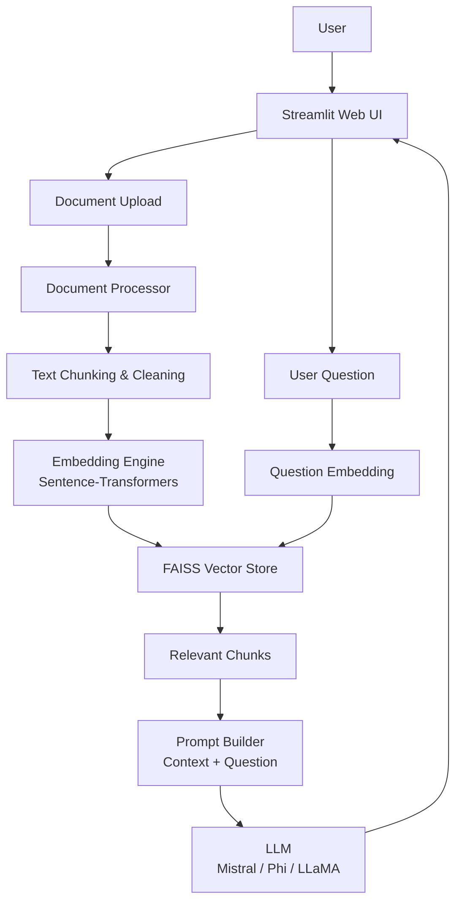

# AI Document Question Answering Chatbot (RAG)

An AI-powered chatbot that answers questions directly from uploaded documents instead of guessing. The system uses Retrieval-Augmented Generation (RAG) to first search relevant information from PDFs/files and then generate accurate, context-aware answers using modern Transformer-based language models.

This project demonstrates a complete, production-style RAG pipeline built with Python, Hugging Face Transformers, PyTorch, FAISS, LangChain, and Streamlit.

---

## Key Features

* Upload and process PDF or text documents
* Semantic search over documents using vector embeddings
* Accurate question answering grounded in document content
* Transformer-based LLMs (Mistral / Phi / LLaMA)
* Clean, interactive web UI using Streamlit
* Modular, layered system design

---

## Architecture Diagram



This diagram shows the full Retrieval-Augmented Generation (RAG) workflow, including document ingestion, vector search, and answer generation.

---

## Demo


A short walkthrough showing document upload, question input, and context-aware answers generated by the chatbot.

---

## Tech Stack

**Programming Language**

* Python

**LLMs & NLP**

* Hugging Face Transformers
* PyTorch
* Sentence-Transformers
* Mistral / Phi / LLaMA (pluggable)

**Retrieval & Storage**

* FAISS (Vector Database)
* ChromaDB (optional)

**Frameworks & Tools**

* LangChain (RAG orchestration)
* Streamlit (UI)

---

## System Design Flow (Step-by-Step)

1. User opens the web application
2. User uploads PDF or document files
3. System extracts text from documents
4. Text is split into manageable chunks
5. Each chunk is converted into embedding vectors
6. Embeddings are stored in a FAISS vector database
7. User asks a natural language question
8. Question is converted into a vector embedding
9. FAISS retrieves top relevant document chunks
10. Prompt is built using:

    * Retrieved context
    * User question
11. LLM generates the final response
12. Answer is displayed in the UI

---

## Architecture Overview (Layered Design)

### 1. Presentation Layer (UI Layer)

**Technology:** Streamlit

**Responsibilities:**

* Upload PDFs and documents
* Accept user questions
* Display chatbot responses

---

### 2. Application Layer (Logic Layer)

The core logic and orchestration layer.

**Components:**

**a) Document Processor**

* Reads PDF files
* Extracts text
* Splits text into chunks
* Cleans and normalizes content

**b) Embedding Engine**

* Converts text chunks into vector embeddings
* Uses sentence-transformers

**c) Retrieval Engine**

* Performs semantic similarity search
* Retrieves top-matching chunks
* Uses FAISS / ChromaDB

**d) Prompt Builder**

* Combines user question with retrieved context
* Builds a structured prompt for the LLM

---

### 3. Model Layer (AI Layer)

**Contains:**

* Transformer-based LLMs (Mistral / Phi / LLaMA)

**Function:**

* Generates human-like answers grounded in retrieved document context

---

### 4. Data Layer

**Stores:**

* Document text chunks
* Vector embeddings
* Metadata

**Tools:**

* FAISS
* ChromaDB

---

## Installation & Setup

### requirements.txt

```txt
streamlit
langchain
langchain-community
huggingface-hub
transformers
torch
sentence-transformers
faiss-cpu
chromadb
pypdf
numpy
scikit-learn
tqdm
```

### Setup Instructions

```bash
# Clone the repository
[git clone https://github.com/your-username/your-repo-name.git](https://github.com/Abhishek-09-Tomar/ai-document-chatbot.git)
cd your-repo-name

# Create virtual environment
python -m venv venv
source venv/bin/activate  # On Windows: venv\\Scripts\\activate

# Install dependencies
pip install -r requirements.txt

# Run the Streamlit app
streamlit run app.py
```

```bash
# Clone the repository
[git clone https://github.com/your-username/your-repo-name.git](https://github.com/Abhishek-09-Tomar/ai-document-chatbot.git)
cd your-repo-name

# Create virtual environment
python -m venv venv
source venv/bin/activate  # On Windows: venv\Scripts\activate

# Install dependencies
pip install -r requirements.txt

# Run the Streamlit app
streamlit run app.py
```

---

## Example Usage

**User uploads documents:**

* machine_learning_notes.pdf
* deep_learning_research.pdf

**User Question:**

> What is the difference between supervised and unsupervised learning?

**Chatbot Answer:**

> Supervised learning uses labeled data to train models, while unsupervised learning works on unlabeled data to discover patterns. This answer is generated using relevant sections retrieved from the uploaded documents.

---

## Why Retrieval-Augmented Generation (RAG)?

* Prevents hallucinations by grounding answers in documents
* Improves accuracy and reliability
* Scales to large document collections
* Keeps LLM context windows efficient

---

## Use Cases

* Document-based question answering
* Research paper analysis
* Company policy or legal document search
* Academic notes and textbook Q&A
* Internal knowledge base chatbot

---

## How to Run (High-Level)

1. Clone the repository
2. Install dependencies
3. Run the Streamlit app
4. Upload documents and start asking questions

---

## Future Improvements

* Multi-document chat history
* Source citation in answers
* Support for more file formats
* Cloud deployment
* Authentication and access control

---

## Project Highlights

* End-to-end Retrieval-Augmented Generation (RAG) system
* Semantic search using embeddings and FAISS
* Transformer-based LLM integration
* Modular, layered architecture (UI, Logic, Model, Data)
* Production-style system design suitable for scaling

---

## Interview & Resume Talking Points

* Designed a complete RAG pipeline to reduce LLM hallucinations
* Used vector embeddings and FAISS for efficient semantic retrieval
* Implemented chunking strategies to optimize context windows
* Integrated open-source LLMs via Hugging Face and LangChain
* Built an interactive UI using Streamlit for real-world usability
* Demonstrates strong understanding of NLP, embeddings, and system design

---

---

## Connect with Me

<p align="left">
  <a href="https://github.com/Abhishek-09-Tomar" target="_blank">
    
  </a>
  <a href="https://www.linkedin.com/in/abhishek-tomar-7aa29127b" target="_blank">
    
  </a>
</p>

## License

MIT License

